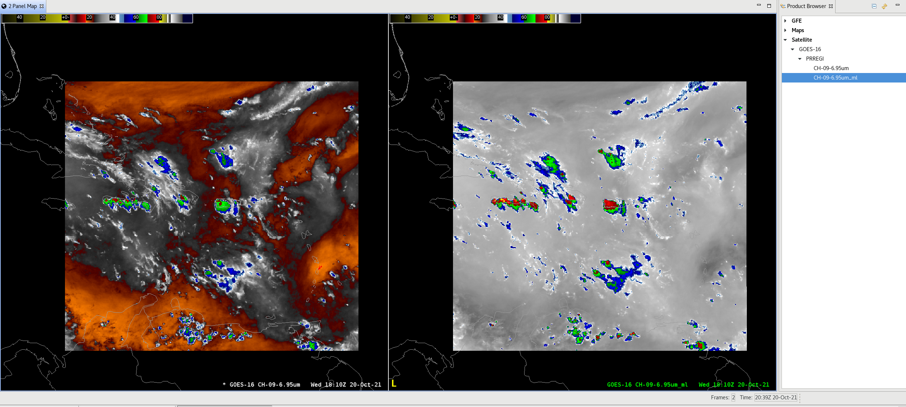
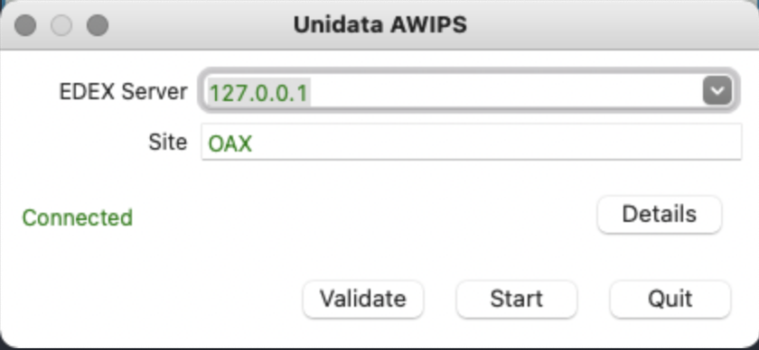
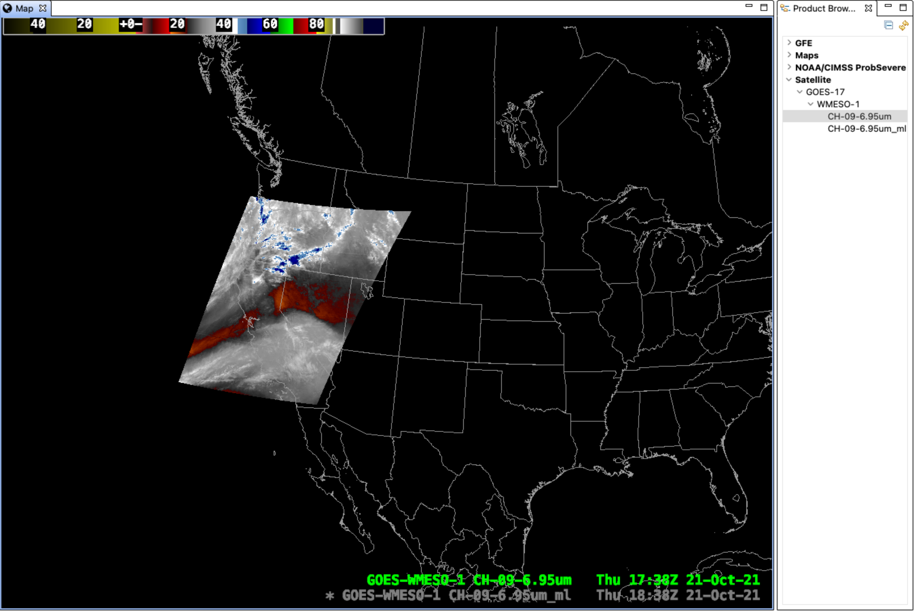

# awips-ml
awips-ml allows users to visualize [TensorFlow](https://www.tensorflow.org/) machine learning models witihin [AWIPS](https://www.unidata.ucar.edu/software/awips2/) via [CAVE](https://unidata.github.io/awips2/install/install-cave/).

More information can be found in the [wiki](https://github.com/rmcsqrd/awips-ml/wiki).

awips-ml is tested for Docker version 3.5.2. Later versions of docker may not work due to [this](https://github.com/rmcsqrd/awips-ml/wiki/awips-ml-usage-guide#docker-compose-error-failed-to-mount-cgroup-at-sysfscgroupsystemd-operation-not-permitted).



## Quickstart<a name="tc_quickstart"></a>
These instructions assume that [Docker](https://docs.docker.com/get-docker/),
[Docker Compose](https://docs.docker.com/compose/install/), and
[CAVE](https://unidata.github.io/awips2/install/install-cave/) are installed
(CAVE is required for viewing only). This git repository comes pre-loaded with
a script to generate an example model so no configuration is required for demonstration purposes.

First, start by cloning this repository, building the containers (this will take ~20 minutes depending on internet speed), and launching then containers.
```
git clone https://github.com/rmcsqrd/awips-ml.git
cd awips-ml
docker-compose build
docker-compose up
```
Next, connect CAVE to the EDEX docker container. The default `docker-compose.yml` file is set such that the default CAVE port will be forwarded from the docker network namespace to the host OS network namespace. Connect by starting CAVE and entering your "EDEX Server" as `127.0.0.1` (or `localhost`) as shown:



If a validation error occurs that is okay, sometimes it takes a while for the EDEX container to start; continue clicking "Validate" or "Start" until it says "Connected".

Once CAVE is opened, open the "Product Browser" via `CAVE > Data Browsers > Product Browser`. A window to the right side of the screen should appear. Load the original data and the data that has been run through the ML model via the Product Browser by clicking `Satellite > GOES-17 > WMESO-1 > CH...`.
- If `Satellite` is unavailable in the Product Browser, wait a few minutes and click the refresh button in the upper right-hand corner of the Product Browser.
- If no data appears in the product browser after waiting (~5min), the upstream LDM may be rejecting the EDEX containers requests; this is usually due to an invalid IP address (requests need to come from `.edu` IP address ranges or other approved IP address ranges) - see [Troubleshooting](#tc_troubleshooting).

When the data is loaded, your screen should look something like the image below. You can toggle the loaded data by clicking the text in the lower right-hand side of the "Map" window.



You can shut down the EDEX containers by running
```
docker-compose down
```
